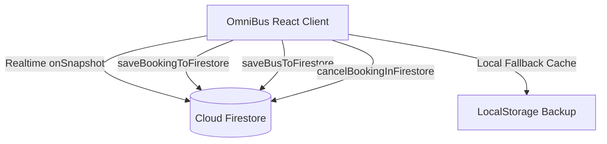

# Firebase Cloud Database Setup & Schema Reference

**Project ID**: `bus-ticketing-7e4d1`  
**Web App ID**: `1:384762358688:web:889bb9b6e517ebf56fd2c5`  
**Measurement ID**: `G-L620Z0DD5X`

---

## 1. Architecture Overview

The OmniBus India Express application is now connected to **Firebase Cloud Firestore** with realtime synchronization (`onSnapshot`), automatic local offline caching, and optimistic UI updates.



---

## 2. Collections & Schema Constraints

### `buses` Collection
Each document represents a scheduled interstate express coach.
- **Document ID**: Unique Bus ID (e.g., `bus-ind-101`, `bus-ind-102`)
- **Fields**:
  - `id` *(string)*: Unique coach identifier.
  - `name` *(string)*: Service name (e.g., `"VRL Travels Multi-Axle I-Shift"`).
  - `operator` *(string)*: Registered operator (e.g., `"VRL Logistics Ltd."`).
  - `type` *(string)*: Vehicle class (e.g., `"Volvo 9600s AC Sleeper (2+1)"`).
  - `category` *(string)*: `"sleeper"` | `"seater"` | `"electric"` | `"budget"`.
  - `from` *(string)*: Origin city (e.g., `"Bengaluru"`).
  - `to` *(string)*: Destination city (e.g., `"Hyderabad"`).
  - `departureTime` *(string)*: Departure time (e.g., `"09:30 PM"`).
  - `arrivalTime` *(string)*: Arrival time (e.g., `"06:15 AM"`).
  - `duration` *(string)*: Trip duration (e.g., `"8h 45m"`).
  - `price` *(number)*: Base fare in INR.
  - `originalPrice` *(number)*: Strike-through fare in INR.
  - `availableSeatsCount` *(number)*: Dynamic available seats count.
  - `hasWashroom` *(boolean)*: In-cabin washroom availability.
  - `isGovtRTC` *(boolean)*: State transport corporation flag (KSRTC, TSRTC, etc.).
  - `liveTracking` *(boolean)*: AIS-140 GPS tracker flag.
  - `rating` *(number)*: Aggregate customer rating (1.0 to 5.0).
  - `reviewsCount` *(number)*: Total passenger reviews.
  - `amenities` *(array of strings)*: Wi-Fi, Water Bottle, Blanket, Charging, etc.
  - `boardingPoints` *(array of objects)*: `[{ id, name, time, landmark }]`
  - `droppingPoints` *(array of objects)*: `[{ id, name, time, landmark }]`
  - `lowerDeck` *(array of objects)*: `[{ id, number, type, deck, price, status, isFemaleOnly }]`
  - `upperDeck` *(array of objects)*: `[{ id, number, type, deck, price, status, isFemaleOnly }]`
  - `createdAt` *(timestamp)*: Creation server timestamp.
  - `updatedAt` *(timestamp)*: Last update timestamp.

### `bookings` Collection
Each document represents a confirmed or cancelled passenger reservation.
- **Document ID**: Official Indian PNR number (e.g., `IND-OB-892418-EXP`)
- **Fields**:
  - `pnr` *(string)*: Unique primary reservation key.
  - `busId` *(string)*: Reference ID of the booked bus.
  - `busName` *(string)*: Coach name.
  - `operator` *(string)*: Fleet operator name.
  - `type` *(string)*: Coach type.
  - `from` *(string)*: Origin city.
  - `to` *(string)*: Destination city.
  - `date` *(string)*: Date of journey (YYYY-MM-DD).
  - `departureTime` *(string)*: Departure time.
  - `arrivalTime` *(string)*: Arrival time.
  - `boardingPoint` *(string)*: Boarding stop name.
  - `boardingTime` *(string)*: Boarding time.
  - `droppingPoint` *(string)*: Dropping stop name.
  - `droppingTime` *(string)*: Dropping time.
  - `seats` *(array of objects)*:
    - `seatNumber` *(string)*: e.g., `"L1"`
    - `passengerName` *(string)*: e.g., `"Rahul Sharma"`
    - `age` *(string/number)*: Passenger age
    - `gender` *(string)*: `"Male"` | `"Female"`
    - `idProofType` *(string)*: e.g., `"Aadhaar Card (UIDAI)"`
    - `idProofNumber` *(string)*: Verified ID number
    - `isIdVerified` *(boolean)*: UIDAI/MoRTH verification status
    - `price` *(number)*: Seat price
  - `contactInfo` *(object)*:
    - `email` *(string)*: Notification email
    - `phone` *(string)*: Mobile number with OTP verification
    - `isPhoneVerified` *(boolean)*: True
  - `addOns` *(object)*:
    - `insurance` *(boolean)*
    - `snackBox` *(boolean)*
    - `carbonOffset` *(boolean)*
  - `totalAmount` *(number)*: Final paid amount in INR.
  - `status` *(string)*: `"CONFIRMED"` | `"CANCELLED"`.
  - `paymentMethod` *(string)*: e.g., `"UPI (Google Pay)"`, `"RuPay Card"`.
  - `liveStatus` *(string)*: e.g., `"Scheduled on time"`.
  - `createdAt` *(timestamp)*: Server booking timestamp.
  - `updatedAt` *(timestamp)*: Server modification timestamp.

---

## 3. Cloud Firestore Security Rules

The security rules are defined in [`firestore.rules`](file:///c:/Users/HP/Desktop/bus-ticketing/firestore.rules):

```javascript
rules_version = '2';
service cloud.firestore {
  match /databases/{database}/documents {
    match /buses/{busId} {
      allow read, write: if true;
    }
    match /bookings/{bookingId} {
      allow read, create, update: if true;
      allow delete: if false; // Protects booking history from deletion
    }
    match /{document=**} {
      allow read, write: if true;
    }
  }
}
```

> **To apply in Firebase Console**:
> 1. Visit [Firebase Console](https://console.firebase.google.com/project/bus-ticketing-7e4d1/firestore/rules)
> 2. Navigate to **Firestore Database** -> **Rules** tab.
> 3. Paste the contents of `firestore.rules` and click **Publish**.

---

## 4. Installed Packages & Modules

- **Firebase SDK**: `firebase` (`^12.19.0`)
- **Config module**: [`src/firebase/config.js`](file:///c:/Users/HP/Desktop/bus-ticketing/src/firebase/config.js)
- **Database service**: [`src/services/firebaseDb.js`](file:///c:/Users/HP/Desktop/bus-ticketing/src/services/firebaseDb.js)

---

## 5. Built-in Admin & Seeding Capabilities

In the **Fleet Portal** tab, administrators can:
- See the real-time **Firebase Cloud Database** status badge.
- View total synced buses and passenger bookings count.
- Click **"Sync / Seed Cloud DB"** to synchronize the complete 12+ interstate Indian express routes catalog and seed bookings into Cloud Firestore with one click.
